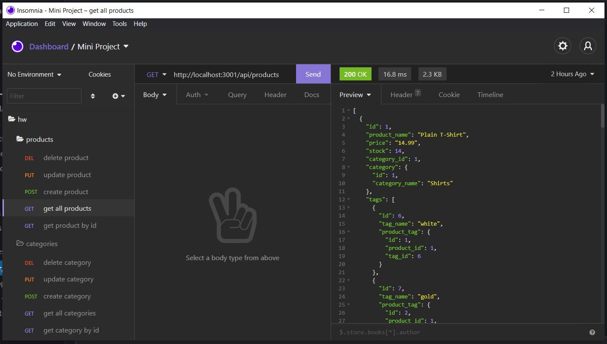

# E-Commerce Backend (Alex Wilson)
HW Assignment Object-Relational Mapping (ORM): E-Commerce Back End

## Description
 Back end application for an e-commerce site, utilizing an Express.js API with Sequelize interacting with a MySQL database.

- [Link to Github Repository](https://github.com/AlexWilsonNC/e-commerce-backend-alexw)

- [Walkthrough Vid: mysql/seed/start](https://drive.google.com/file/d/11UVSMYODF8fUlWfrOjKNwgsKQXFj0bMZ/view?usp=sharing)

- [Walkthrough Vid: Get All](https://drive.google.com/file/d/1MPbvLLU9097Mi40aFXMxbMGlo3uCVNZr/view?usp=sharing)

- [Walkthrough Vid: Get by ID](https://drive.google.com/file/d/1uOZMJxfJvpd0K7osvTVgpkirV24cg1Nz/view?usp=sharing)

- [Walkthrough Vid: Product Create/Update/Delete](https://drive.google.com/file/d/124A_tG0LQuUd5RR1BEfnSNKDTRts-2Jk/view?usp=sharing)

- [Walkthrough Vid: Category Create/Update/Delete](https://drive.google.com/file/d/10o1F6SdMj1nrFWXjy4jREt5bWkLXt3AX/view?usp=sharing)

- [Walkthrough Vid: Tag Create/Update/Delete](https://drive.google.com/file/d/1SUhEAdOnqF8S3WBlpkXmzB4-V2z2MEiT/view?usp=sharing)

## Screenshot
